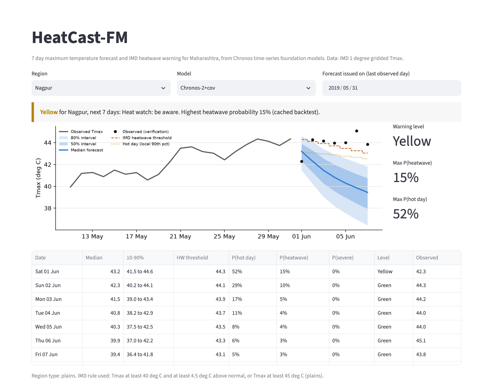

# HeatCast-FM

**Probabilistic heatwave early warning for Mumbai-Pune using generative time-series foundation models**

HeatCast-FM forecasts daily maximum temperature (Tmax) 7 days ahead for Maharashtra with
the Chronos family of pretrained time-series models (Chronos, Chronos-Bolt, Chronos-2). It
turns each forecast into the probability of a hot day, an IMD heatwave and a severe
heatwave, and issues a Green / Yellow / Orange / Red warning. The Chronos models are used
zero-shot: they are never trained on Indian data.

Mini project for the Generative AI Laboratory (Experiment 8), use case KJS-CES-01:
*Climate Intelligence for Heatwave Monitoring, Prediction and Early Warning* (IMD Mumbai-Pune).

**Live demo:** https://aditya-ravi11.github.io/HeatCastFM/ (runs in the browser, nothing to install)



## Highlights

- 74 years of IMD 1 degree gridded Tmax and Tmin (1951-2024) for 7 focus cities and 36 inland grid cells.
- IMD heatwave rules for plains and coastal stations, written as a single Tmax threshold per day.
- Nine forecasters compared in a rolling backtest over every March-June day of 2015-2024.
- Point validation against city-level data, with a loader ready for real IoT weather station (AWS) files.
- Humid heat analysis showing how often the Tmax-only rule misses dangerous heat on the Konkan coast.
- A Streamlit viewer for any region, model and date.

## Results

Test seasons 2019-2024, all 43 series, 220,332 forecast-observation pairs per model.
CRPS and MAE pool leads 1-7 (deg C, lower is better). Hot-day BSS and heatwave AUC use leads 1-3.

| Model | Type | CRPS | MAE | 80% coverage | Hot-day BSS | Heatwave AUC |
|---|---|---|---|---|---|---|
| Chronos-2 + covariates | zero-shot foundation model | 0.988 | 1.38 | 0.75 | 0.285 | 0.964 |
| Chronos-2 | zero-shot foundation model | 0.989 | 1.38 | 0.77 | 0.281 | 0.974 |
| Chronos-Bolt | zero-shot foundation model | 1.019 | 1.42 | 0.78 | 0.280 | 0.982 |
| Quantile LSTM | trained on 1951-2014 | **0.935** | **1.30** | 0.78 | **0.344** | **0.983** |
| AR on anomalies | trained on 1951-2014 | 0.943 | 1.31 | 0.82 | 0.297 | 0.976 |
| Persistence | reference | 1.063 | 1.47 | 0.80 | 0.276 | 0.982 |
| Climatology | reference | 1.194 | 1.69 | 0.77 | 0.000 | 0.908 |

- Zero-shot Chronos-2 is about 17% better than climatology on CRPS and close to the trained models at a 1-day lead (all around 0.6 deg C). The trained models pull ahead at longer leads.
- Chronos intervals are too narrow (75-78% coverage for a nominal 80%).
- Adding relative humidity to Chronos-2 helps at the focus cities (CRPS 0.921 to 0.907).
- Correcting grid forecasts to the city point roughly halves the error at Mumbai and Ratnagiri.
- At Mumbai the heat index passed the NOAA Danger level on 360 March-June days in 1991-2024 that the Tmax rule did not flag.

Full results, figures and discussion are in the report: [`report/HeatCast-FM_Report.pdf`](report/HeatCast-FM_Report.pdf).

## How it works

```
IMD gridded Tmax/Tmin --> normals (1981-2010), IMD rule and hot-day thresholds
Open-Meteo point data --> humidity covariate and station proxy
                              |
                              v
        Chronos-2 / Chronos-Bolt / Chronos-T5 (zero-shot)  +  baselines
                              |  7-day quantiles or sample paths
                              v
        P(hot day), P(heatwave), P(severe) --> Green / Yellow / Orange / Red
                              |
                              v
        point correction and validation, verification scores, viewer app
```

| Level | Meaning | Rule |
|---|---|---|
| Green | no warning | |
| Yellow | heat watch | P(hot day) above a threshold tuned on 2015-2018 |
| Orange | heatwave alert | P(IMD heatwave) above a threshold tuned on 2015-2018 |
| Red | severe heatwave | P(IMD severe heatwave) of 0.5 or more |

IMD criteria used (Tmax in deg C, departure from the daily normal):

- **Plains:** heatwave if Tmax is at least 40 and the departure at least 4.5, or Tmax is at least 45. Severe if the departure is at least 6.5 (with Tmax at least 40), or Tmax is at least 47.
- **Coastal (Mumbai, Ratnagiri):** heatwave if Tmax is at least 37 and the departure at least 4.5. Severe if the departure is at least 6.5.

## Setup

Requires Python 3.11. Tested on an Apple M4 laptop (16 GB) with [uv](https://github.com/astral-sh/uv).

```bash
git clone https://github.com/aditya-ravi11/HeatCastFM.git
cd HeatCastFM
uv venv --python 3.11 .venv
uv pip install --python .venv/bin/python -e .
```

With plain pip:

```bash
python3.11 -m venv .venv
.venv/bin/pip install -e .
```

## Usage

### Web viewer (GitHub Pages)

The static viewer in `docs/` is published at https://aditya-ravi11.github.io/HeatCastFM/.
It shows the saved backtest forecasts for the 7 focus regions and all models, with no
server or Python needed. Open a specific view with URL parameters, for example
`?region=Nagpur&date=2019-05-31`. After rerunning the backtest, refresh its data with
`python scripts/08_export_web.py`.

To try it locally: `cd docs && python -m http.server 8000`, then open http://localhost:8000.

### Viewer app (Streamlit)

The Streamlit version can also run Chronos-2 live for dates outside the backtest.

The viewer needs the data and cached forecasts, so run the pipeline below first.

```bash
.venv/bin/streamlit run app/streamlit_app.py
```

Pick a region, a model and an issue date. The page opens directly on a view with URL parameters,
for example `http://localhost:8501/?region=Nagpur&date=2019-05-31`.

### Full pipeline

```bash
scripts/run_all.sh
```

Or step by step:

| Step | Command | What it does | Time on a laptop |
|---|---|---|---|
| 1 | `python scripts/01_download.py` | IMD Tmax/Tmin 1951-2024 and Open-Meteo point data | 30-60 min (IMD server is slow) |
| 2 | `python scripts/02_prepare.py` | grid cells, normals, IMD labels, hot-day thresholds | 1 min |
| 3 | `python scripts/03_backtest.py` | all models over the 2015-2024 hot seasons | 2-4 h (Chronos-2 with covariates and Chronos-T5 are the slow ones) |
| 4 | `python scripts/04_evaluate.py` | scores, warnings, bootstrap, point validation, humid heat | 5 min |
| 5 | `python scripts/05_figures.py` | report figures | 1 min |
| 6 | `python scripts/06_report_tables.py` | LaTeX tables and number macros for the report | seconds |

A single model can be run with `python scripts/03_backtest.py Chronos-2`. Forecasts are saved in
chunks, so an interrupted run resumes where it stopped.

### Tests

```bash
.venv/bin/python -m pytest -q
```

## Data

| Source | Variables | Period | Use |
|---|---|---|---|
| IMD 1 degree gridded temperature, via [IMDLIB](https://github.com/iamsaswata/imdlib) | daily Tmax, Tmin | 1951-2024 | forecasting target, labels, covariate |
| [Open-Meteo archive](https://open-meteo.com/) (ERA5 based) | daily Tmax, Tmin, relative humidity | 1990-2024 | humidity covariate, station proxy, heat index |

Focus regions: Mumbai and Ratnagiri (coastal rule), Pune, Jalgaon, Chhatrapati Sambhajinagar,
Nagpur and Chandrapur (plains rule). Regions, years and thresholds are set in `config.yaml`.

### Using real AWS data

Put one CSV per station with columns `timestamp,temp_c,rh_pct` and load it with:

```python
from heatcast.aws_ingest import load_aws_csv
daily = load_aws_csv("station.csv", region="Mumbai")
```

Readings are range and step checked, and days with less than 75% coverage are dropped. The output has the same
columns as the Open-Meteo station proxy, so it can replace it for that city.

## Models

| Model | Details |
|---|---|
| Persistence | today's Tmax with the training error distribution per lead and month |
| Climatology | daily normal plus the anomaly spread seen within 15 days of the date |
| AR on anomalies | order chosen by AIC per series, Gaussian intervals |
| Quantile LSTM | 2 layers, 64 units, 60-day window, pinball loss |
| Chronos-T5 (small) | generative: samples future tokens one day at a time (20 paths) |
| Chronos-Bolt (small) | direct 9-quantile forecast |
| Chronos-2 | 21-quantile forecast, optionally with Tmin, normal Tmax, season and humidity covariates |

LoRA fine-tuning of Chronos-2 (`scripts/03b_finetune.py`) was too slow on the laptop and was not completed.
It is ready to run on a CUDA GPU; the evaluation scripts pick up its forecasts automatically.

## Repository layout

```
config.yaml               regions, years, IMD thresholds, model ids
src/heatcast/             data, labels, models, probabilities, metrics, warnings, point correction
scripts/                  pipeline steps 01 to 08
app/streamlit_app.py      Streamlit viewer (with live Chronos-2 runs)
docs/                     static web viewer published on GitHub Pages
tests/                    unit tests for labels, probabilities and scores
outputs/metrics/          score tables (CSV, JSON)
outputs/figures/          report figures and app screenshots
report/                   LaTeX source and the PDF report
```

## Authors

- Aditya Ravi (16014223004), aditya.ravi@somaiya.edu
- Dirshak Deep Patro (16014223033), dirshak.p@somaiya.edu

Department of Information Technology (AI & DS), K. J. Somaiya College of Engineering, Mumbai.

## References

- Ansari et al., *Chronos: Learning the Language of Time Series*, TMLR 2024.
- Ansari et al., *Chronos-2: From Univariate to Universal Forecasting*, arXiv:2510.15821, 2025.
- Srivastava, Rajeevan and Kshirsagar, *Development of a high resolution daily gridded temperature data set for the Indian region*, Atmospheric Science Letters, 2009.
- Nandi, Patel and Swain, *IMDLIB*, Environmental Modelling & Software, 2024.
- India Meteorological Department, *FAQ on Heat Wave*.
